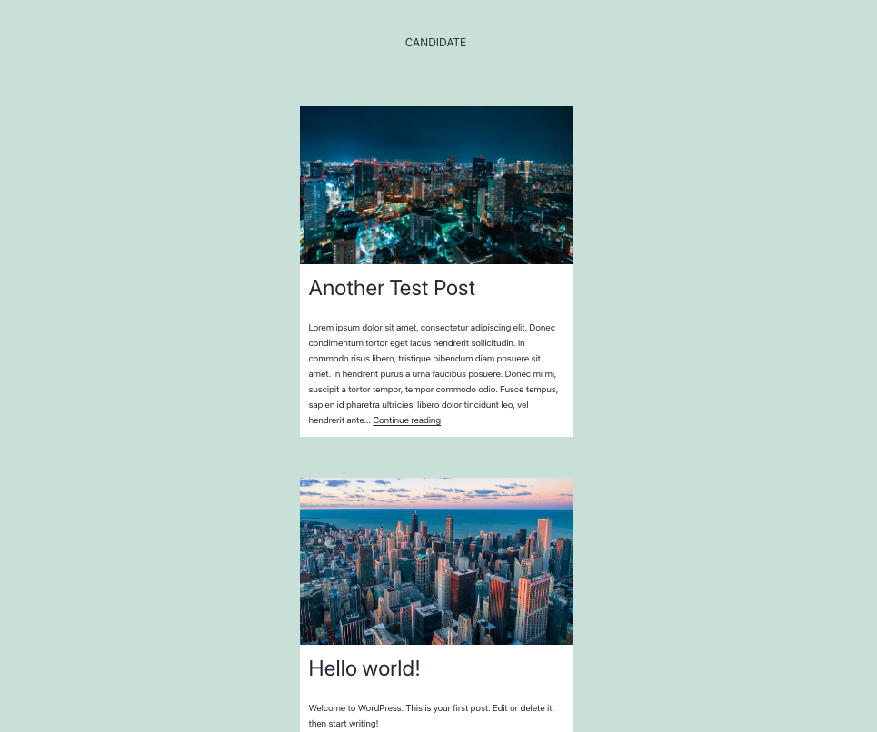

# Practical WordPress Mission

## Skills required

1. Install WordPress in your local machine.
1. Utilize Git to keep track of changes in WordPress.
1. Creating WordPress child themes to update a parent theme.
1. Follow WordPress customization patterns.
1. Writing custom CSS.

## Briefing

1. Create a WordPress local installation.
1. Use git to version control your work and commit as you go.
1. Create a child theme to modify the Twentey Twenty One default theme
1. Update the homepage to use a card design like in the attached image (use any image you like)

## Designs

    

## Expectations

- The test must be completed solely by you. Use any coding tools and resources that you are familiar with to simulate authentic dev conditions.
- We expect this task to be done in up to 45min.

