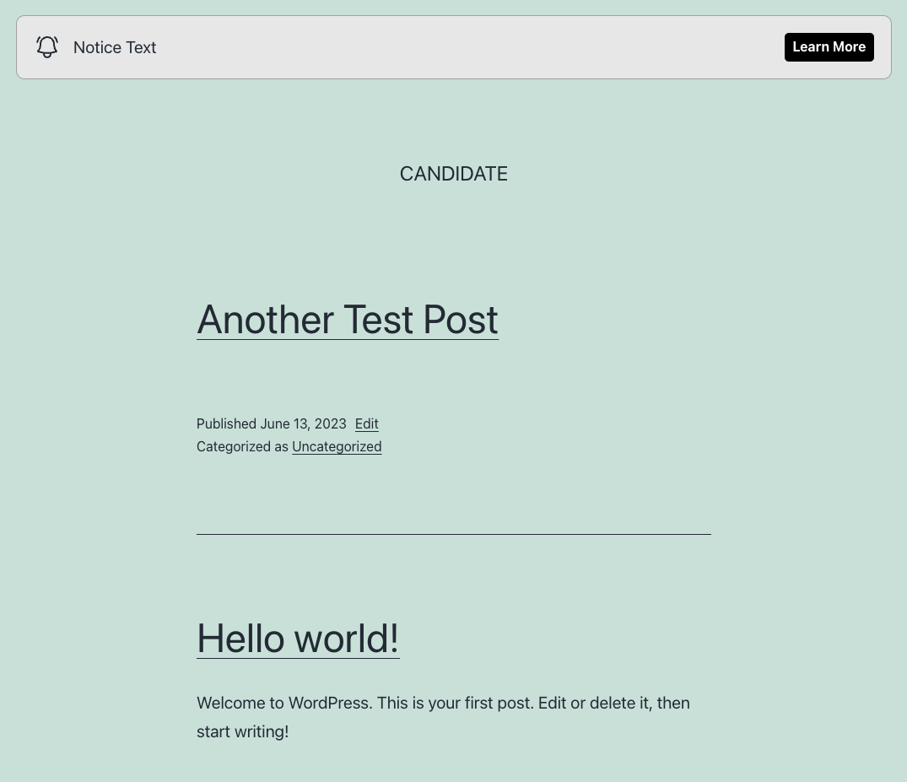
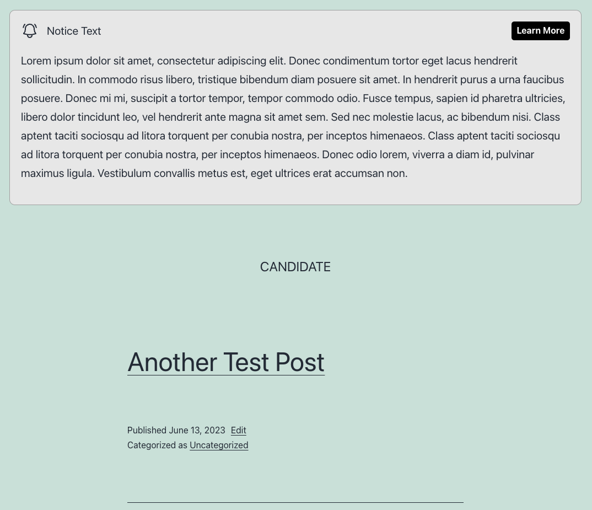

# Practical WordPress Mission

## Skills required

1. Install WordPress in a local machine.
1. Utilize Git to keep track of changes in WordPress.
1. Creating WordPress plugins.
1. Follow WordPress customization patterns.
1. Identifying and using specific theme hooks.
1. Integrate third-party plugin into your own code.
1. CSS and JS skills.

## Briefing

1. Create a WordPress local installation.
1. Use git to version control your work and commit as you go.
1. Create plugin code that adds a global alert banner to the top of the Twenty Twenty One classic theme. See [banner design](https://www.figma.com/file/pasOUazcXHCSt8YPyz8oBx/Untitled?type=design&node-id=0%3A1&t=yqDtWF6rHuzxpm7m-1) in figma.
1. Banner button should open a new message.
1. Authors should be able to remove this banner from specific pages and posts.
1. You can use plugins to create custom fields only.
1. Push the code to a GitHub repo at the end.

## Designs

<div style="display: flex; max-width: 100%">
    
    
</div>

## Expectations

- The test must be completed solely by you. Use any coding tools and resources that you are familiar with to simulate authentic dev conditions.
- We expect this task to be done in up to 1h.

## Assets

### Bell icon
```
<svg xmlns="http://www.w3.org/2000/svg" fill="none" viewBox="0 0 24 24" stroke-width="1.5" stroke="currentColor" class="w-6 h-6">
  <path stroke-linecap="round" stroke-linejoin="round" d="M14.857 17.082a23.848 23.848 0 005.454-1.31A8.967 8.967 0 0118 9.75v-.7V9A6 6 0 006 9v.75a8.967 8.967 0 01-2.312 6.022c1.733.64 3.56 1.085 5.455 1.31m5.714 0a24.255 24.255 0 01-5.714 0m5.714 0a3 3 0 11-5.714 0M3.124 7.5A8.969 8.969 0 015.292 3m13.416 0a8.969 8.969 0 012.168 4.5" />
</svg>
```
